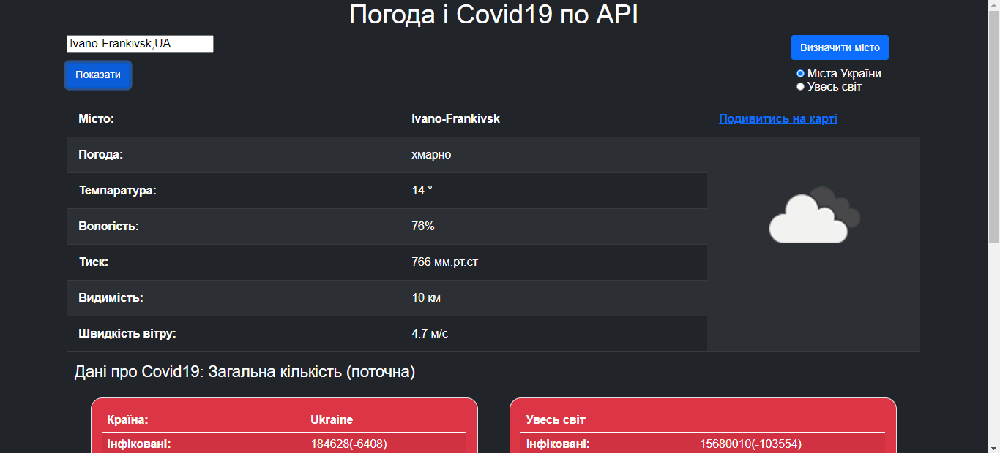
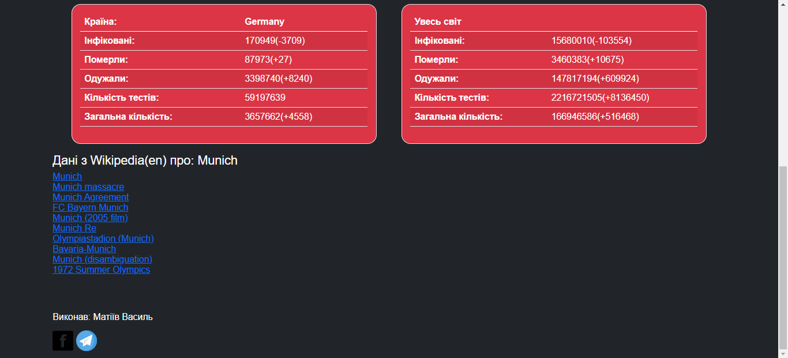

#Weather Covid Wiki

## Install

This project uses [node](http://nodejs.org) and [npm](https://npmjs.com). Go check them out if you don't have them locally installed.

```sh
$ npm install
```

```sh
$ npm run start
```

Open http://localhost:4000 to view it in the browser.

## Usage

To see weather conditions you need to add a city or tap on 'Визначити місто'. In addition to the weather for your chosen location, you can also see position on the map, statistics of covid19 diseases in the selected country along with ten first wikipedia links.




##Technologies:
JavaScript, Bootstrap, HTML, SASS. Api, Ajax, Function and Class Components.
